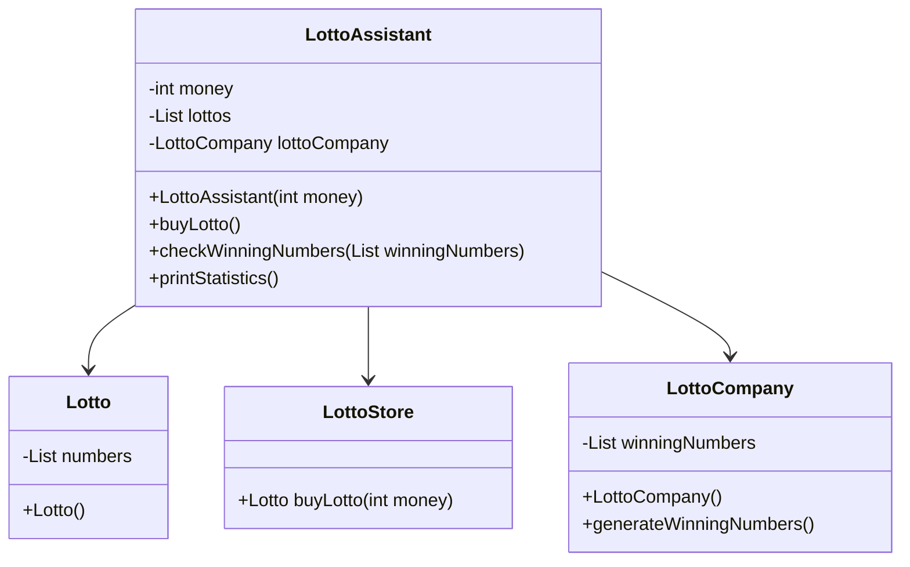

# 🎲 로또 계산기

## **기능 요구사항**
- 로또 구입 금액을 입력하면 구입 금액에 해당하는 로또를 발급해야 한다.
- 로또 1장의 가격은 1000원이다.
- 로또 번호를 자동으로 생성하고, 지난 주 당첨 번호와 비교하여 당첨 결과와 수익률을 계산해 준다.

## 주요 기능
- **로또 구매**: 입력한 금액에 따라 로또를 구매할 수 있다.
- **로또 번호 생성**: 1~45 사이의 6개 번호를 중복 없이 무작위로 생성한다.
- **당첨 번호 입력**: 지난 주 당첨 번호(6개)를 입력받아 결과를 비교한다.
- **당첨 통계 출력**: 일치 개수별 당첨 횟수, 수익률을 계산하여 출력한다.

## 클래스 다이어그램

## history
### 🟡 2025년 4월 18일  
파일 생성  
심플하게 로또 번호를 생성하는 프로그램을 작성합니다.

### 🟡 2025년 4월 19일  
클래스를 어떻게 구성할지 고민해 보자.    
내가 돈을 들고 로또 판매점으로 간다.  
내가 가지고 있는 돈에 맞게 로또 용지에 번호를 작성을 한다.  
용지를 가지고 주인장에게 준다.  
기계가 인식을 해서 표를 출력해 준다.  
로또 영수증을 받아서 토요일까지 즐거운 맘으로 기다린다.  
매주 토요일 오후 8시 35분 MBC 생방송으로 로또 번호를 알려 준다.  
두근 그리는 맘으로 확인을 해 본다.  
일치하는 것이 있는지 확인하고 수익률을 계산한다.  

나, 로또, 로또판매점, 복권회사  

나(LottoAssistant) 전체 적인 관리. 돈. 당첨통계. 로또영수증들.  
로또(Lotto) 로또 번호.  
로또판매점(LottoStore) 로또 판매.  
복권회사(LottoCompany) 당첨번호.  로또 번호생성. 당첨금 계산.

### 🟡 2025년 4월 20일
당첨금 계산을 switch 문으로 했는데 enum으로 변경을 해 보자.

