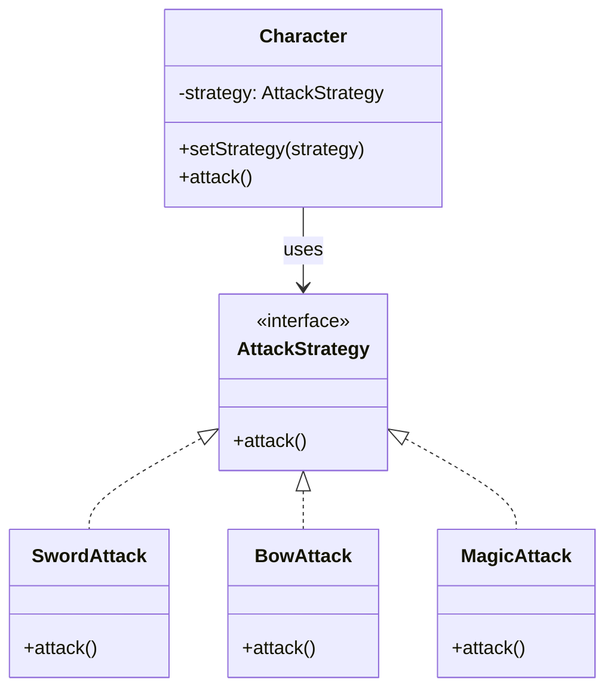

## 숙제
### 아래 디자인 패턴 간단하게 이해해오기
proxy pattern  
factory pattern  
template method pattern  
strategy pattern  

### 1. Proxy Pattern(프록시 패턴)  
본인 작업을 위임.  
왜? 나도 모르겠다.  
검색에서는  
- **보안**: 아무나 진짜 객체를 못 쓰게 막을 수 있다.
- **성능**: 진짜 객체를 늦게 만들고 싶을 때 대신 만들어 준다.
- **접근 제어**: 사용할 수 있는 조건을 걸 수 있다.

그냥 본인에서 해도 될 것 같은데...


### 2. Factory Pattern(팩토리 패턴)
**필요한 객체를 직접 만들지 않고, 공장에게 만들어 달라고 부탁하는 방법**  
왜? 같은 인터페이스 상속받은 클래스를 한 곳에서 객체를 만들기 위해서  
나중에 같은 인터페이스 상속받은 클래스 추가해도 공장만 살짝 바꾸면 되니깐 유지 보수가 쉽다.  


```java
// 1. 아이템 인터페이스
interface Item {
    void use();
}

// 2. 실제 아이템 클래스들
class HealingPotion implements Item {
    public void use() {
        System.out.println("❤️ 체력을 회복합니다!");
    }
}

class ManaPotion implements Item {
    public void use() {
        System.out.println("🔵 마나를 회복합니다!");
    }
}

class AttackBoost implements Item {
    public void use() {
        System.out.println("💥 공격력이 잠시 증가합니다!");
    }
}

// 3. 아이템 공장 (Factory)
class ItemFactory {
    public static Item createItem(String type) {
        switch (type) {
            case "healing":
                return new HealingPotion();
            case "mana":
                return new ManaPotion();
            case "boost":
                return new AttackBoost();
            default:
                throw new IllegalArgumentException("❌ 알 수 없는 아이템 타입: " + type);
        }
    }
}

// 4. 사용 예 (게임 플레이 상황)
public class Game {
    public static void main(String[] args) {
        Item item1 = ItemFactory.createItem("healing");
        item1.use(); // ❤️ 체력 회복

        Item item2 = ItemFactory.createItem("mana");
        item2.use(); // 🔵 마나 회복

        Item item3 = ItemFactory.createItem("boost");
        item3.use(); // 💥 공격력 증가
    }
}
```


### 3. Template Method Pattern(템플릿 메서드 패턴)
**전체 흐름은 부모 클래스가 정하고, 자세한 부분은 자식 클래스가 정하는 디자인 패턴**  
**뼈대는 부모가 만들고, 살은 자식이 붙이는 패턴**

#### 몬스터 AI 행동!

모든 몬스터는 이렇게 행동해:
1. 나타난다
2. 공격한다 (← **이건 몬스터마다 다름!**)
3. 사라진다


```java
// 부모 클래스: 행동 순서만 정함
abstract class MonsterAI {
    public final void act() {
        appear();
        attack();   // 이건 자식이 정함
        disappear();
    }

    void appear() {
        System.out.println("👾 몬스터가 나타난다!");
    }

    abstract void attack();  // 자식이 정함

    void disappear() {
        System.out.println("💨 몬스터가 사라진다!");
    }
}

// 자식 클래스: 공격 방식 다르게 정의
class Dragon extends MonsterAI {
    void attack() {
        System.out.println("🔥 드래곤이 불을 뿜는다!");
    }
}

class Slime extends MonsterAI {
    void attack() {
        System.out.println("슬라임이 튕기며 공격한다!");
    }
}


// 사용 예
public class Game {
    public static void main(String[] args) {
        MonsterAI dragon = new Dragon();
        MonsterAI slime = new Slime();

        dragon.act();
        slime.act();
    }
}
```

클래스 다이어그램  


### 4. Strategy Pattern(전략 패턴)
> 상황에 따라 전략(방법)을 바꾼다.
> 즉, **행동을 객체로 따로 빼놓고, 필요할 때마다 갈아끼운다.**

#### 캐릭터가 공격할 때!

- 검으로 공격하기 ⚔️
- 활로 공격하기 🏹
- 마법으로 공격하기 🔮

→ 상황에 따라 **공격 전략을 바꿀 수 있게** 만들면 좋아요.

### ✅ 예시

```java
// 전략 인터페이스
interface AttackStrategy {
    void attack();
}

// 다양한 전략들
class SwordAttack implements AttackStrategy {
    public void attack() {
        System.out.println("⚔️ 검으로 공격!");
    }
}

class BowAttack implements AttackStrategy {
    public void attack() {
        System.out.println("🏹 활로 공격!");
    }
}

class MagicAttack implements AttackStrategy {
    public void attack() {
        System.out.println("🔮 마법으로 공격!");
    }
}

// 캐릭터 클래스
class Character {
    private AttackStrategy strategy;

    public void setStrategy(AttackStrategy strategy) {
        this.strategy = strategy;
    }

    public void attack() {
        strategy.attack();
    }
}

// 사용 예
public class Game {
    public static void main(String[] args) {
        Character hero = new Character();

        hero.setStrategy(new SwordAttack());
        hero.attack();  // ⚔️ 검으로 공격

        hero.setStrategy(new BowAttack());
        hero.attack();  // 🏹 활로 공격

        hero.setStrategy(new MagicAttack());
        hero.attack();  // 🔮 마법으로 공격
    }
}
```

> **전략 패턴**은 **"전략을 갈아끼울 수 있는 게임 캐릭터"**처럼 생각하면 된다.  
> 상황에 따라 유연하게 행동을 바꾸게 도와주는 거라고 생각하면 된다.


클래스 다이어그램  



